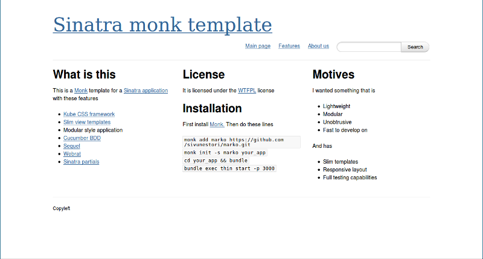

marko
=====

Lightweight Sinatra app template for Monk (http://monkrb.com/).
It is a mixture of Monk's riblits template git://github.com/Phrogz/riblits.git and
http://snippets.aktagon.com/snippets/568-Sinatra-App-Template

Features
========

- Modular style Sinatra application http://www.sinatrarb.com/
- Kube CSS framework http://imperavi.com/kube/
- Slim view templates http://slim-lang.com/
- Cucumber BDD http://cukes.info/
- Sequel http://sequel.rubyforge.org/
- Webrat https://github.com/brynary/webrat
- Sinatra partials https://github.com/yb66/Sinatra-Partial

Screenshot
==========


Licence
=======

It is licensed under the WTFPL license.
https://en.wikipedia.org/wiki/WTFPL

Installation
============
```sh
monk add marko https://github.com/sivunestori/marko.git
monk init -s marko your_app
cd your_app && bundle
bundle exec thin start -p 3000
```
Then open up http://localhost:3000/ in your browser.

Running UI/IT tests
===================
```sh
bundle exec cucumber features/home.feature
```

Running other tests
===================
Other tests are located in test/controllers and test/models.  Minitest
is configured to use specs, because in my opinion they are more
readable.
```sh
bundle exec rake test
```

